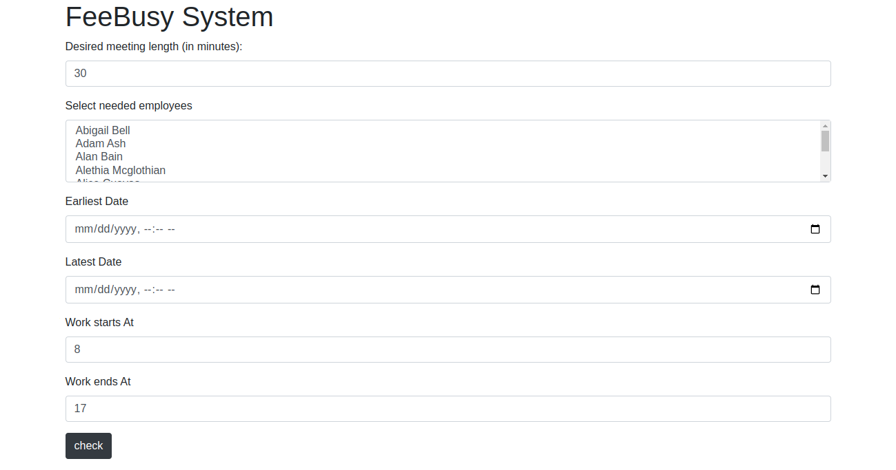
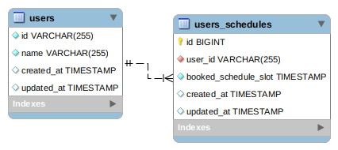

# FreeBusy web solution with laravel

### Problem description:

The mega corporation has a custom built system for handling meetings which has been around
since the beginning of time and which is now deemed too hard to use. Since management doesn’t really know
how important the system is they have invested far too little resources in the upgrade project and have
decided to hire a single poor contractor (guess who) to solve the most important problems in almost no time.

As a first step, management has asked for an application that works independently of the existing system and
that can be called to get suggestions for suitable meeting times based on the following parameters:

```
 participants (employee ids), one or multiple
 desired meeting length (minutes)
 earliest and latest requested meeting date and time
 office hours (e.g. 08-17)
```

The application can be either an HTTP API or a console application.

At regular intervals all information is dumped from the existing system to a number of text files where the
freebusy.txt file contains details on when all employees are busy the next few weeks.

An excerpt from the file can look like this:

```
170378154979885419149243073079764064027;Colin Gomez
170378154979885419149243073079764064027;2/18/2014 10:30:00 AM;2/18/2014 11:00:00 AM;485D2AEB9DBE3...
139016136604805407078985976850150049467;Minnie Callahan
139016136604805407078985976850150049467;2/19/2014 10:30:00 AM;2/19/2014 1:00:00 PM;C165039FC08AB4...
```

As it seems, the file has lines in two different formats where the first one contains employee id and display
name and the second format has information on the time slots where the employee is busy and therefore not
available for meetings.

The following can be good to know:

```
 In the file, all times stated can be treated as local times – no need to adjust for timezone differences
 apparently it is quite common that people work every day of the week
 due to the crappy state of the existing system the file may contain some irregularities, these should
be ignored
 the system only handles meetings that start every whole and half hour, e.g. 08.00, 08.30, 09.00, etc.
```

Unfortunately, everyone who knew something about the old system have fled the company a long time ago.
Questions regarding how the new API/application should work can however be answered.

# How TO Run This Solution:

- make sure that `.env` file existed, if not existed please make a copy from `.env.example`

- Please be sure that you install last version of <a href="https://getcomposer.org/"> composer</a>
  then run in the project root: `composer install`

- This solution has been dockerized using `laravel sail` so the next stop is to run the
  containers: ``` vendor/bin/sail up -d ```

- migrate the database schema: `vendor/bin/sail artisan migrate`

- next step run the tests: `vendor/bin/sail artisan test `

- load the old provided data from `data/freebusy.txt` using laravel db seeds:
  `vendor/bin/sail artisan  db:seed`

- now the system is up, running and ready to be used as web app please visit your
- <a href="http://localhost">localhost</a> to use it as web view or find swagger end
  point <a href="http://localhost/api/docs">swagger docs</a>
- json data example

```json
{
    "length": "30",
    "ids": [
        "112744177331057436352972918186353829893",
        "233712410387129370706224914414146750411"
    ],
    "earliest": "2022-08-25T14:00",
    "latest": "2022-08-25T15:30",
    "startAt": "8",
    "endAt": "17"
}
```

find the home page with form to select and set what you need:

- Desired meeting length `period in munites `
- Select needed employees `needed employees to be check`
- Earliest Date `first data to be considered`
- Latest Date `overdue time of the meeting`
- Work starts At `the compay start work at hour`
- Work ends At `the compay end work at hour`



### database simple schema



- Users table

    - id `string` unique
    - name`string`
    - created_at`timestapm`
    - updated_at`timestapm`


- Users schedules table `to contain the users old reserved slots`

    - id `int` unique, incremental
    - user_id`string` reference to the `users` table
    - booked_schedule_slot`timestamp` to save each slot time
    - created_at`timestapm`
    - updated_at`timestapm`

## conclusion

This solution consisted from 2 module:

- The module of loading the old data, which generates the reserved slots and save it in the database
- the service module of meetings which makes:
    - generation of each possible time slot from the date which the user send
    - validate each possible time slots compared with `needed length` and `the selected users reserved slots`.
    - return the valid slots to results page


